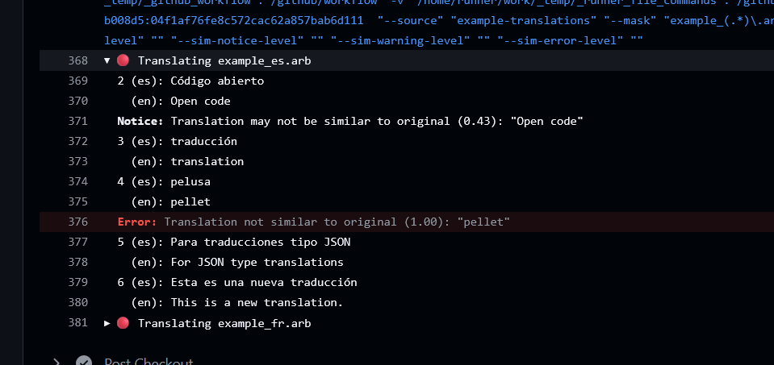
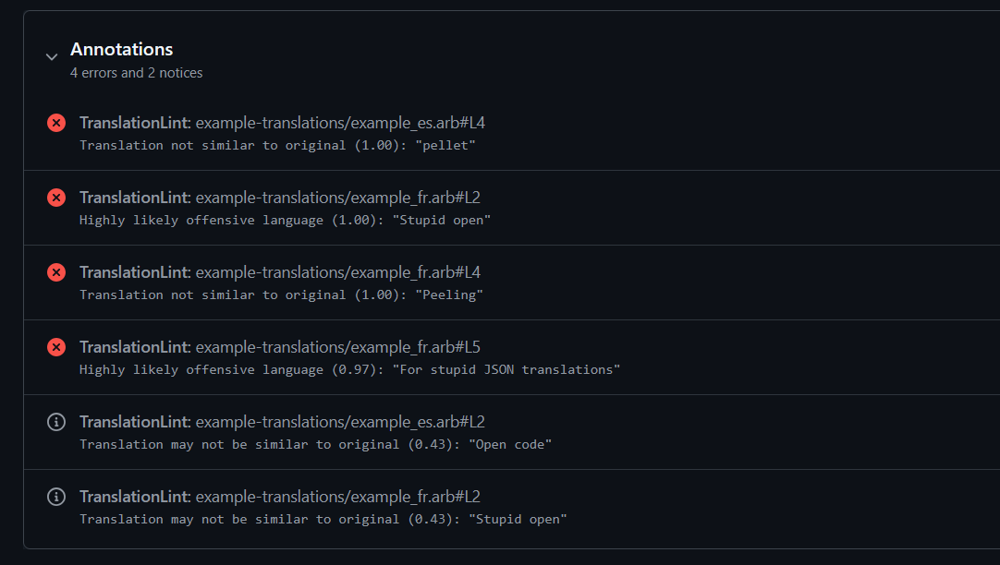
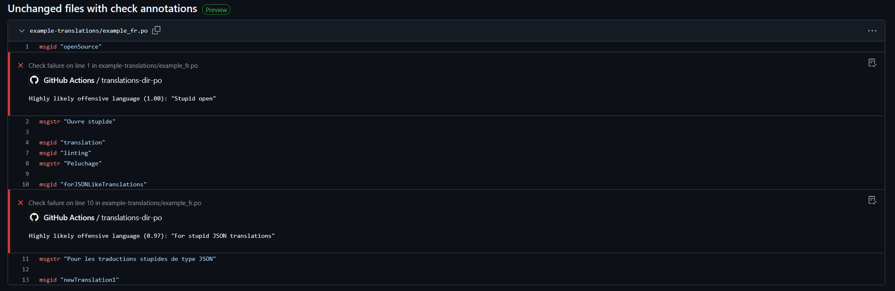

# Translation Linter

GitHub action for auto-translating l10n files back into English for easier
review. Also automatically checks for potentially offensive language in
translation files, as well as translation similarity.

Auto-translations are provided by [Argos
Translate](https://github.com/argosopentech/argos-translate), profanity checking
provided by [(Alt) Profanity
Check](https://github.com/dimitrismistriotis/alt-profanity-check), and similarity checking is done by [spaCy](https://github.com/explosion/spaCy).

At the moment this action supports JSON translation files like .arb, as well as
gettext formats like .po and .pot.

## Usage

[**Example Workflow File**](./.github/workflows/example-action.yaml)

Add the following as a GitHub workflow file (e.g. `.github/workflows/example-action.yaml`):

```yaml
name: YOUR_WORKFLOW_NAME
on:
  workflow_dispatch:
  pull_request:
  push:
    branches: [main]

jobs:
  YOUR_JOB:
    name: YOUR_JOB_NAME
    runs-on: ubuntu-latest
    steps:
      - name: Checkout
        uses: actions/checkout@v4
      - name: YOUR_STEP_NAME
        uses: ashuntu/translation-linter@main
        with:
          # Change this to the directory containing your translations
          # REQUIRED
          translation-dir: "translations"
          # RegEx file mask to match translation files
          # The first group match () should contain the language code
          # OPTIONAL
          file-mask: "app_(.*)\\.arb"
          # File path to original, untranslated file for similarity checking
          # OPTIONAL
          template: "translations/app_en.arb"
```

*You may also customize the thresholds for profanity/similarity warnings. See
all input options in [action.yml](./action.yml).*

### Testing Locally

You can test this action locally by doing the following:

1. Clone the repository
2. Run `pip install -r requirements.txt`
3. Run `python main.py` with options
    ```shell
    # For example...
    python main.py --source example-translations --mask "example_(.*)\\.arb" --template example-translations/example_en.arb
    ```

## Output

See the [most recent action
run](https://github.com/ashuntu/translation-linter/actions) from this repo for
an example of the output this action generates.

Profanity warnings are on a scale of 0 to 1, where 0 is definitely no profanity and 1 is most likely profanity. Similarity warnings are on a scale of 0 to 1, where 0 is completely similar, and 1 is not at all similar.

<details>
<summary>Example output screenshots</summary>







</details>
